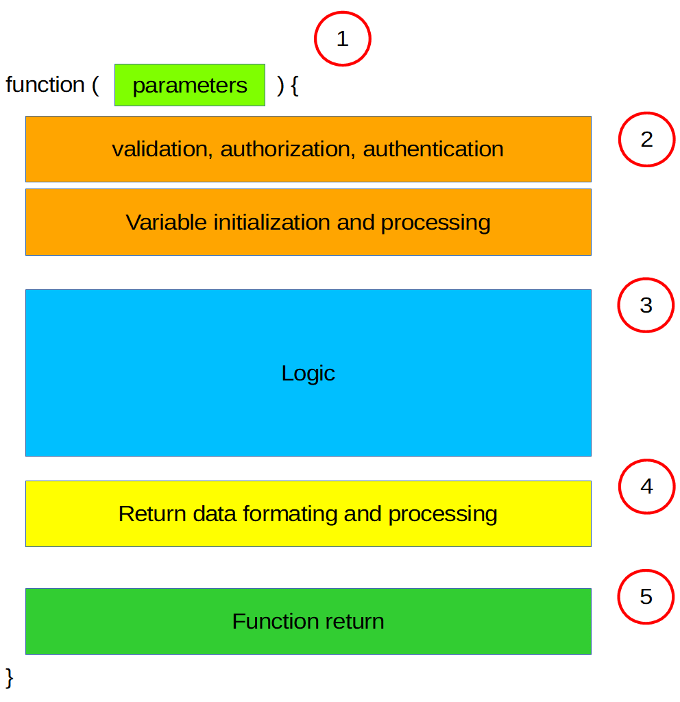

# trident
A laravel code generator for developing applications following Domain Driven Design (DDD) principles

At the moment this package is at alpha stage.

# Introduction

The purpose of this package is to assist in creating laravel applications using Domain Driven Design (DDD) and Test Driven Development (TDD) principles. The way it is achieved is by creating an application structure  through code generation. 

The main rationale behind this is that the code generated takes care of all the wiring and architecture enforcing DDD and TDD principles and leaves the developer with the space to focus on implementing business logic. 

## Application architecture

### Preface

The main design principles behind the architecture that will be explained in the next sections are derived from deconstructing the basic building block of an application, which is the `function`. We can segregate a function to its parts by the purpose they have. The majority of functions that are written in any modern web application could be more or less described by the following schema.



1. function parameters: ideally there should be a definite structure to every parameter, either being some basic type like int or string, or more complex like a collection with defined types. Generic types like object or array should be avoided.
2. validation, authorization, authentication: incoming paremeters should be validated against set well defined set of rules. This ensures that the function input is set as the main function logic assumes, which leads to better function behaviour. Authentication and authorization most of the times come hand in hand and their purpose is to ensure that the function is used by it's indented user
   1. Variable initialization and processing: it is a good practise to set any variable that is going to be used in the function in the beggining not just for clarity reasons but to seperate the logic from constantly interacting with external resources, like a database or a filesystem. This helps organize better the logic that is going to follow as you can make a pre-processing of incoming parameters and the extra layer of abstraction can to make the logic easier to understand and maintain in the future. E.x. `$action_name` is better to be used in function's logic than `$request->action_name`.
3. Logic: every function is build for a purpose and that purpose is described by this section. This section should not have calls to external resources (like a database or a filesystem) because it makes maintainance and refactoring more difficult. 
4. Return data formating and processing: After the function logic section data should be formatted in a well defined way for return. If a function must interact with any external resources this is the place to do such a job. 
5. Function return: the data that should be returned by the function after being processed by the logic. Should contain only data that are meaningful to the purpose of the function and not its status, meaning that if a function fails for some reason to do its job an `exception` should be thrown and NOT `return false;` 

### Folder structure

The package on install creates among others the following folder structure

```

|* app
    |- Models
    |- Policies
        |- Trident
    |- Trident
        |- Base
        |- Business
            |- Exceptions 
            |- Validations
            |- Logic 
            |- Schemas
        |- Workflows
            |- Exceptions
            |- Repositories
            |- Validations
            |- Logic
            |- Events
                |- Triggers
                |- Listeners
                |- Subscribers
            |- Schemas
        |- Intefaces
```
Where `|* app` is the app directory of a laravel application.

The goal of this structure is to isolate the sections of a function that have been described previously so that the logic is seperated from any other part. So the `Polices` folder handles authorization, authentication (2), `Validations` handles validation (2), `Schemas` folder handles structure of function parameters and function return if necessary (1)(5), `Logic` handles function logic, Variable initialization and return (3)(4)

The creation of the two folders `Workflows` and `Business` is derived from the thought process behind the creation of a new functionallity for a web app. Commonly when a new feature needs to be implemented you think in steps. 

Let's say you want to create a list of all users. You will propably think: 1) I have to make a call to the server, 2) fetch the data from the database with whatever parameters i have from the request, 3) prepare my data, 4) prepare my view/html, 5) combine my data with my view/html, 6) respond back to the client. This thought process is described here in the `Workflows` folder. 

The `Logic` folder in `Workflows` is the place where all this process will be described. At this point it should be pointed out that this is not a replacement to MVC design pattern, on the contrary it is complimentary. The MVC ideally should only handle requests and responses and nothing else, the core functionallity should be elsewhere, in our case in `Workflows` -> `Logic`. 

The `Logic` in `Workflows` gives a good level of isolation for the whole process but if the core logic was implemented there it would still be directly dependent on external resources (database, filesystem). This is the reason for the existance of the folder `Business`. The `Logic` folder there is only for logic and nothing else. 

To give an example to demonstrate this lets say we have the following workflow logic snipset with the accompanied controller and business:

Workflow:
```php
<?php

namespace App\Trident\Workflows\Logic;

use Illuminate\Http\Request;
use App\Trident\Workflows\Exceptions\Test_workflowException;
use App\Trident\Interfaces\Workflows\Repositories\Test_workflowRepositoryInterface as Test_workflowRepository;
use App\Trident\Interfaces\Workflows\Logic\Test_workflowInterface;
use App\Trident\Interfaces\Business\Logic\Test_workflowInterface as Test_workflowBusiness;

class Test_workflow implements Test_workflowInterface
{

    /**
     * @var Test_workflowRepository
     */
    protected $Test_workflow_repository;

    /**
     * constructor.
     *
     * @var string
     * @return void
     */
    public function __construct(Test_workflowBusiness $Test_workflowBusiness, Test_workflowRepository $Test_workflowRepository)
    {
        $this->Test_workflow_repository = $Test_workflowRepository;
        $this->Test_workflow_business = $Test_workflowBusiness;
    }

    /**
     * Store a newly created resource in storage.
     *
     * @param  \Illuminate\Http\Request  $request
     * @return \Illuminate\Http\Response
     */
    public function store(Request $request)
    {
        $data = $request->all();
        $data['user_id'] = auth()->id();
        
        $username = $data['username'];

        $username = $this->Test_workflow_business->add_suffix($username,'_edit');

        $data['username'] = $username;

        return $this->Test_workflow_repository->create($data);
    }


}

```

Business:
```php
<?php

namespace App\Trident\Business\Logic;

use App\Trident\Business\Exceptions\Test_workflowException;
use App\Trident\Interfaces\Business\Logic\Test_workflowInterface;


class Test_workflow implements Test_workflowInterface
{

    /**
     * constructor.
     *
     * @var string
     * @return void
     */
    public function __construct()
    {
       //
    }

    /**
     * put a suffix to a string.
     *
     * @param  string  $string
     * @return string
     */
    public function destroy(string $string, string $suffix): string
    {
        return $string.$suffix;
    }

}

```

Controller:
```php
<?php

namespace App\Http\Controllers\Trident;

use App\Http\Controllers\Controller;
use Illuminate\Http\Request;
use Illuminate\Container\Container as App;
use App\Trident\Workflows\Validations\StoreRequest;
use App\Trident\Interfaces\Workflows\Logic\Test_workflowInterface as Test_workflowWorkflow;
use App\Trident\Interfaces\Workflows\Repositories\Test_workflowRepositoryInterface as Test_workflowRepository;
use App\Trident\Workflows\Exceptions\Test_workflowException;

class Test_workflowController extends Controller
{
    /**
     * @var Test_workflow
     */
    protected $Test_workflow;

    public function __construct(Test_workflowWorkflow $Test_workflowWorkflow, Test_workflowRepository $Test_workflow_repository)
    {
        $this->Test_workflow_workflow = $Test_workflowWorkflow;
        $this->Test_workflow_repository = $Test_workflow_repository;
    }


    /**
     * Store a newly created resource in storage.
     *
     * @param  \Illuminate\Http\Request  $request
     * @return \Illuminate\Http\Response
     */
    public function store(StoreRequest $request)
    {
        $this->authorize('store',$this->test_workflow_restful_crud_repository);
        return response()->json( $this->Test_workflow_workflow->store($request) );
    }

    
}

```

So in this example the `Test_workflowController` calls `Test_workflow` from workflow which calls `Test_workflow` from logic. Authentication, authorization and validation are being done in the controller before we reach the workflow, the workflow interacts with the database (our only external source in this example) and the business only does logic. By this paradigm all concerns are seperated and isolated using native laravel functionallity (IoC DI, Exceptions, Policies, Validations, authentication) and we have a good structure for pure unit, integration, functional tests.

Luckily all this structure is generated by this package's artisan commands with basic restful crud functionallity and authentication, authorization.

Folders:

- app: the laravel app folder
- Models: all generated laravel models are constructed here
- Policies: laravel policies
- Base: makes abstractions to the laravel framework for the case of reimplementation in the future
- Workflows: the new functionallity process without the core logic
- Business: the core logic isolated
- Interfaces: the interfaces for any part of `Workflows` and `Business`


# Installation instructions

## to add to a laravel project as a package
add 
```json
"repositories": [
    {
        "type": "vcs",
        "url": "https://github.com/j0hnys/trident"
    }
],
```
and 
```json
"require-dev": {
    "j0hnys/trident": "dev-master"
},
```
to laravels `composer.json`

## to install in laravel

after executing `php artisan trident:install` add 

```
App\Providers\TridentAuthServiceProvider::class,
App\Providers\TridentEventServiceProvider::class,
App\Providers\TridentRouteServiceProvider::class,
App\Providers\TridentServiceProvider::class,
```

to config/app

# Available artisan commands

| Command | Description |
|---|---|
trident:export:model     |                      export a models schema
trident:generate:business_logic_function  |     Create a business logic function
trident:generate:controller_function       |    Create a controller function
trident:generate:events                    |   Create an event
trident:generate:exception                 |  Create an exception
trident:generate:factory                   |   Create a factory for a model
trident:generate:policy_function           |    Create a policy function
trident:generate:restful_crud              |    Create a RESTFUL CRUD
trident:generate:validation                |   Create a validation
trident:generate:workflow                  |   Create a workflow
trident:generate:workflow_logic_function   |   Create a workflow logic function
trident:generate:workflow_restful_crud     |   Create a workflow with the accompanied restful crud
trident:generate:workflow_test_logic_function |  Create workflow test logic function
trident:generate:workflow_tests            |     Create workflow tests
trident:install                            |   Trident installer
trident:setup:tests                        |   Trident test setup

## Basic usage

1. `php artisan make:migration create_demo_process`
2. fill in the appropriate data in the migration file
3. `php artisan migrate`
4. `php artisan trident:generate:workflow_restful_crud DemoProcess`

In the end of this process the following will be created:
- a new controller with restful CRUD functions will and placed in `app/Http/Controllers/Trident`
- a new resource in `routes/trident.php` behind the native authentication middleware
- a new model in `app/Models`, a new policy for this process and placed in `app/Policies/Trident` 
- a new exception class in `app/Trident/Workflows/Exceptions`
- a new set of validation (FormRequests) and placed in `app/Trident/Workflows/Validations`
- a new repository in `app/Trident/Workflows/Repositories`
- a new logic for this process in `app/Trident/Workflows/Logic` 
- finally a new business logic in `app/Trident/Business/Logic`

If we want to add a new function in the process, let's say a new feature we execute:

1. `php artisan trident:generate:workflow_logic_function DemoProcess [function_name]`

which will create automatically the appropriate functions and wiring in the controller, router, workflow logic, business logic, policy, validation. 

